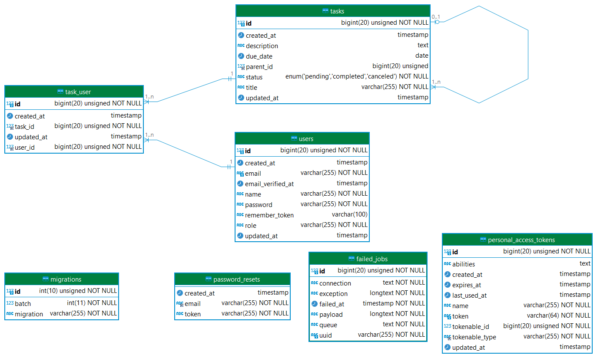

# Task Management API

This Laravel RESTful API, named "task_management_system," allows you to manage tasks, user authentication, and related operations.

## Features

- **User Authentication:** Authenticate users .
- **Task Management:**
  - Create a new task.
  - Retrieve a list of all tasks with filtering options (status, due date range, assigned user).
  - Add task dependencies (a task cannot be completed until all its dependencies are completed).
  - Retrieve details of a specific task, including dependencies.
  - Update task details (title, description, assignee, due date, status).
  - Delete tasks.

- **Role-Based Access Control:**
  - **Managers:**
    - Can create and update tasks.
    - Can assign tasks to users.
  - **Users:**
    - Can retrieve only tasks assigned to them.
    - Can update only the status of tasks assigned to them.

## Prerequisites

Before you begin, make sure you have the following installed:
- PHP >= 8.2
- Composer
- Laravel >= 9
- Postman (for API testing)

## Setup Instructions

1. **Clone the Repository:**

    ```bash
    https://github.com/AhmedHassan199/task_management_system.git
    cd task_management_system
    ```

2. **Install Dependencies:**

    ```bash
    composer install
    ```

3. **Configure Environment:**

    - Duplicate the `.env.example` file and rename it to `.env`.
    - Configure your database settings in the `.env` file.

4. **Generate Application Key:**

    ```bash
    php artisan key:generate
    ```

5. **Run Migrations and Seeders:**

    ```bash
    php artisan migrate
    php artisan db:seed
    ```

6. **Start the Development Server:**

    ```bash
    php artisan serve
    ```

   The API will be accessible at `http://127.0.0.1`.

## Entity Relationship Diagram (ERD)

### User and Task Relationship



# Entity-Relationship Diagram (ERD) Description

## Users
**Attributes:**
- `id` (Primary Key)
- `name`
- `email`
- `password`
- `role`
- `created_at`
- `updated_at`

## Tasks
**Attributes:**
- `id` (Primary Key)
- `title`
- `description`
- `status` (Enum: 'pending', 'completed', 'canceled')
- `due_date`
- `parent_id` (Foreign Key) 
- `created_at`
- `updated_at`

## task_user
**Attributes:**
- `user_id` (Foreign Key, Composite Primary Key)
- `task_id` (Foreign Key, Composite Primary Key)
- `created_at`
- `updated_at`

## Summary of Relationships

**Users and Tasks:**
- Many-to-Many: Users can be assigned to multiple tasks, and tasks can have multiple users.
- This is facilitated through the task_user pivot table.

**Tasks**
 - Self-referencing One-to-Many: Tasks can have child tasks (subtasks), where one task can be a parent to many other tasks.
 - This is achieved through the parent_id column in the tasks table.

## Default Laravel Tables
- `users` (Default Laravel users table)
- `migrations` (Default Laravel migrations table)
- `failed_jobs` (Default Laravel failed jobs table)

## Default Sanctum Tables
- `personal_access_tokens` (Default Sanctum personal access tokens table)

## Import Postman Collection

Download the [Postman Collection](<Documets/Version 1.0.postman_collection.json>) file.
click here for postman doc the [Postman Publich](<Documets/Version 1.0.postman_collection.json>) file.

1. Open Postman.

2. Click on "Import" in the top-left corner.

3. Upload the downloaded Postman Collection file.

## API Requests
Follow the steps below to test API requests using the Postman collection:
Download the [API DOC](<Documets/Task Management API Documentation.pdf>) file.


